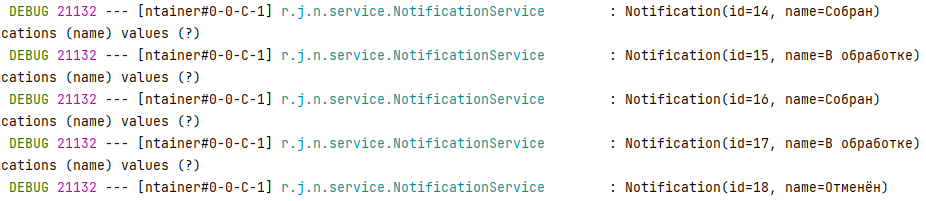

# Микросервисный проект - Доставка еды "Голодный волк".

## Общее описание:

Заказ блюд на дом. Блок уведомления. 
* [Блок заказов](https://github.com/PerpetuumEbner/job4j_order)
* [Блок блюда](https://github.com/PerpetuumEbner/job4j_dish)
* [Блок кухня](https://github.com/PerpetuumEbner/job4j_kitchen)

***

## Реализовано:

* Отправка уведомлений.

***

## Технологии:

***

## Запуск проекта:

* создать базу данных `notifications`
* `maven install`
* `java -jar target/notification-0.0.1-SNAPSHOT.jar`

***

## Структура проекта:

### Отправка уведомлений.
Каждый раз при смене статуса заказа, отправляется уведомление через брокер сообщений и сохраняется в базу данных.

